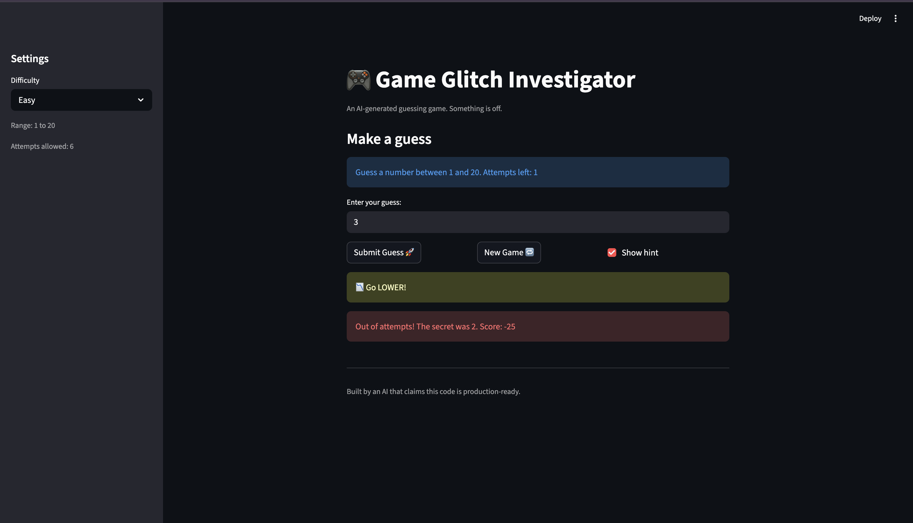

# 🎮 Game Glitch Investigator: The Impossible Guesser

## 🚨 The Situation

You asked an AI to build a simple "Number Guessing Game" using Streamlit.
It wrote the code, ran away, and now the game is unplayable. 

- You can't win.
- The hints lie to you.
- The secret number seems to have commitment issues.

## 🛠️ Setup

1. Install dependencies: `pip install -r requirements.txt`
2. Run the broken app: `python -m streamlit run app.py`

## 🕵️‍♂️ Your Mission

1. **Play the game.** Open the "Developer Debug Info" tab in the app to see the secret number. Try to win.
2. **Find the State Bug.** Why does the secret number change every time you click "Submit"? Ask ChatGPT: *"How do I keep a variable from resetting in Streamlit when I click a button?"*
3. **Fix the Logic.** The hints ("Higher/Lower") are wrong. Fix them.
4. **Refactor & Test.** - Move the logic into `logic_utils.py`.
   - Run `pytest` in your terminal.
   - Keep fixing until all tests pass!

## 📝 Document Your Experience

**Game Purpose:**
A number guessing game built with Streamlit where the player tries to guess a secret number within a limited number of attempts. The player picks a difficulty (Easy, Normal, or Hard) which sets the number range and attempt limit. After each guess the game gives a higher/lower hint and tracks a score.

**Bugs Found:**
1. The Developer Debug Info expander was always visible on the page and showed the secret number — making it trivially easy to cheat.
2. The hint text was hardcoded to "Guess a number between 1 and 100" regardless of difficulty — Easy and Hard modes showed the wrong range.
3. The New Game button only partially reset the game — it used a hardcoded `randint(1, 100)` ignoring difficulty, and never cleared the score, status, or history.
4. Switching difficulty mid-game kept the old secret number (e.g. a Normal-mode secret of 61 would carry into Easy mode, which only goes to 20).
5. The `check_guess` function in `app.py` converted the secret to a string on even-numbered attempts, causing hints to be backwards due to string vs integer comparison.

**Fixes Applied:**
- Removed the debug expander entirely.
- Updated hint text to use the computed `low` and `high` variables.
- Fixed New Game to reset all state and use the correct difficulty range.
- Added difficulty-change detection using `last_difficulty` in session state to regenerate the secret when the player switches modes.
- Refactored `check_guess`, `parse_guess`, `get_range_for_difficulty`, and `update_score` into `logic_utils.py` with clean integer-only comparison.

## 📸 Demo

## 🧪 Edge Case Test Results (Challenge 1)

Edge cases tested via `python3 -m pytest tests/test_game_logic.py -v`:

- **Negative number** (`"-5"`) — parses successfully as `-5`, out of game range but handled without crashing
- **Decimal input** (`"3.7"`) — truncated to `3` silently, game accepts it gracefully
- **Non-numeric string** (`"abc"`) — returns `"That is not a number."` error, no crash

## 🚀 Stretch Features

- [ ] [If you choose to complete Challenge 4, insert a screenshot of your Enhanced Game UI here]
